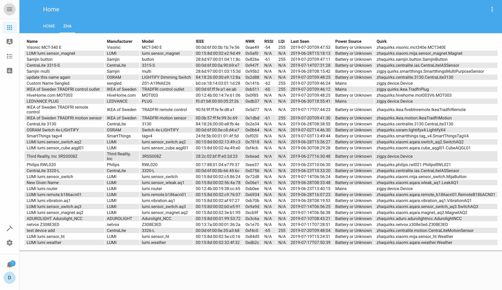

# ZHA Network Card
Custom Lovelace card that displays ZHA network and device information

This is a modified version of https://github.com/custom-cards/flex-table-card This implementation leverages the ZHA websocket API to get ZHA device information instead of using hass.states





# Installation (quick & "dirty")

* Find your homeassistent directory containing your configuration (let's say `~/.homeassistant/`)
* Change into `~/.homeassistant/www` (create the `www` directory, if it is not existing, you then might have to restart HA)
* `$ wget https://raw.githubusercontent.com/dmulcahey/zha-network-card/master/zha-network-card.js` downloads the `.js` file directly where it should reside
* Finally, add the following on top of your UI Lovelace configuration (means either via Config UI or .yaml)
``` yaml
resources:
  - type: js
    url: /local/zha-network-card.js
```
* Verify that it works with one of the examples below

# Configuration

``` yaml
columns:
  - prop: name
    name: Name
  - attr: manufacturer
    name: Manufacturer
  - attr: model
    name: Model
  - attr: ieee
    name: IEEE
  - prop: nwk
    name: NWK
  - attr: rssi
    name: RSSI
  - attr: lqi
    name: LQI
  - attr: last_seen
    name: Last Seen
  - attr: power_source
    name: Power Source
  - attr: quirk_class
    name: Quirk
type: 'custom:zha-network-card'
```

## Available attributes:

```
area_id
device_reg_id
ieee
last_seen
lqi
manufacturer
manufacturer_code
model
name
nwk
power_source
quirk_applied
quirk_class
rssi
user_given_name
```

## Available Props:

```
name
nwk
```

- name - will return user_given_name if it exists or name if it does not

- nwk - will return the hex dislay value of the nwk attr


See https://github.com/custom-cards/flex-table-card for advanced configuration options.
